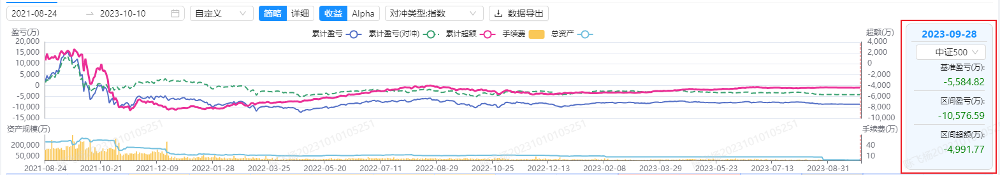

# 结算明细报表 设计实现

## 按产品

todo

## 按投资经理

在按投资经理的结算明细报表页面中, 左侧的目录树为三级结构, 各级的关系是 _基金经理-产品-资产单元_. 实现上是先取 `dim_datahub.dim_unit_account_product` 表, 该表有 _资产单元_ 和 _产品_ 之间的映射关系, 接着利用 `ads_eqw.ads_unit_label_value` 表可以取得 _资产单元_ 和 _基金经理_ 之间的映射关系, 通过用户中心的接口`/api/uc/v1/users` 可以请求得到所有用户的信息. 具体如下所示.

- dim*unit_account_product 表: \_unit_code* 资产单元编码, _unit_name_ 资产单元名称, unit*type 资产单元类型, account_code 资金账号编码, account_name 资金账号名称, account_type 资金账号类型, \_product_inner_code* 产品内部编码, fund*record_number 产品协会编号, \_product_short_name* 产品名称简称, product_full_name 产品名称全称, product_type 产品类型, etl_time 数据入库时间. 目前, 仅仅展示 `unit_type=[1, 3]` 的, 跟凯强确认了下 该字段存在三种取值 `1 普通资产单元, 2 默认资产单元, 3 客户资产单元`.

- ads*unit_label_value 表: deal_date 日期, \_au_code* 资产单元, label 标签, _value_ 标签内容. 设置 `label = 'manager'`, `au_code - value` 就是资产单元和基金经理的映射. 需要注意的是因为存在日期的维度, 存在一个资产单元在不同的日期隶属于不同的基金经理的情况, 该情况在展示上就是每个基金经理都会有该资产单元.

- /api/uc/v1/users 接口: _id_, _userName_, nickName, email, mobile, avatar, status, ext, roles, sex, depts, qywxId, createAt. `status=0` _应该_ 是属于正常状态.

具体实现逻辑是当取得这三张表的数据, 根据 ads_unit_label_value 表生成一个 `Map<基金经理, 资产单元[]>`, 使用 dim_unit_account_product 表生成一个 `Map<资产单元, 产品>`, 根据前面两个 Map 可以产生 `Map<基金经理, Map<产品, 资产单元[]>>`, 利用用户中心 userName 取得基金经理信息进行绑定.

```js
// products 使用 product_inner_code 作为 key
InvestMgrItem{userId: string; userName: string; nickName: string; category: 'investMgr'; name: string; products: Record<string, InvestMgrProduct>}
// units 使用 unit_code 作为 key
InvestMgrProduct{category: 'investProduct'; type: string; name: string; fullName: string; code: string; units: Record<string, StlUnitItem>}
StlUnitItem{category: 'unit'; type: string; name: string; fullName: string; code: string; isDefault: boolean}

// 关联关系
// ads_unit_label_value.au_code --- dim_unit_account_product.
```

### 资产概要 - 具体某日指标

按投资经理的资产概要页面中，有一个统计了标定时间范围内的业绩表现走势图，以及一个查看具体某一天表现的 _块块_，如下图红色框起来的部分。在这个 _块块_ 中有具体三个指标，分别是 `基准盈亏(万)`、`区间盈亏(万)`、`区间超额(万)`。基准盈亏是根据下拉选择的基准指数而不同，具体有 A 股的指数、港股的指数、美股的指数（数据保存在`ads_eqw.ads_eqw_benchmark`）。结算的数据取自 `ads_eqw.ads_unit_balance_pending`，而基准指数的数据取自表 `dm_histdata.bar_day`。

由于不同市场开市情况大不相同，所以存在一种情况，结算有日期 a 的数据，而基准指数没有日期 a 的数据，在这种情况下，处理方式为取距离日期 a 最近的一次有数据的记录作为日期 a 的基准指数的数据进行接下来的计算。


